

# AWS Peering Setup
### Three VPCs · Two Regions · Private connectivity

**Project 01 — AWS Networking**

Connect Web, Application, and Database networks through a full mesh of VPC peering connections.

[Architecture](#architecture) · [Implementation](#implementation) · [Validation](#validation) · [Troubleshooting](#troubleshooting)

---

## Project overview

This lab documents a network design with two VPCs in **US East (N. Virginia)** and a third in **US East (Ohio)**. Each VPC has a direct connection to both peers, providing routes for private traffic across the three networks.

**Implementation evidence:** Ten supplied console screenshots document the Web/App VPCs, peering request workflow, route configuration, inter-Region acceptance, and successful private-IP ICMP replies. The walkthrough below explains how to reproduce the design; the evidence section distinguishes observed results from remaining checks.

## Architecture

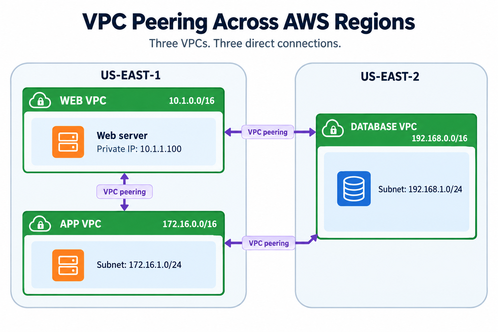

### Address plan

| Component | Region | VPC CIDR | Lab subnet | Test host private IP |
| --- | --- | --- | --- | --- |
| Web | `us-east-1` | `10.1.0.0/16` | `10.1.1.0/24`¹ | `10.1.1.100` |
| Application | `us-east-1` | `172.16.0.0/16` | `172.16.1.0/24` | `172.16.1.100`¹ |
| Database | `us-east-2` | `192.168.0.0/16` | `192.168.1.0/24` | `192.168.1.100`¹ |

¹ Suggested lab values. The supplied diagram specifies the Web host IP and the App and Database subnets, but does not specify the Web subnet or the other host IPs. Substitute your actual values when implementing.

### Connection plan

| Name | Requester | Accepter | Scope |
| --- | --- | --- | --- |
| `web-app-peer` | Web | App | Same Region |
| `web-db-peer` | Web | Database | Inter-Region |
| `app-db-peer` | App | Database | Inter-Region |

**Why three connections?** Peering is not transitive. Web ↔ App and App ↔ Database do not create a Web ↔ Database path. This topology therefore uses a direct peer for every pair. See [AWS peering behavior and limitations](https://docs.aws.amazon.com/vpc/latest/peering/vpc-peering-basics.html).

## Implementation screenshots

### 01 · Establish the Web and App networks

The VPC list shows `10.1.0.0/16` and `172.16.0.0/16` in N. Virginia alongside the default VPC. The App VPC ID differs between this early capture and later captures; use the IDs from your current environment rather than copying IDs across screenshots.

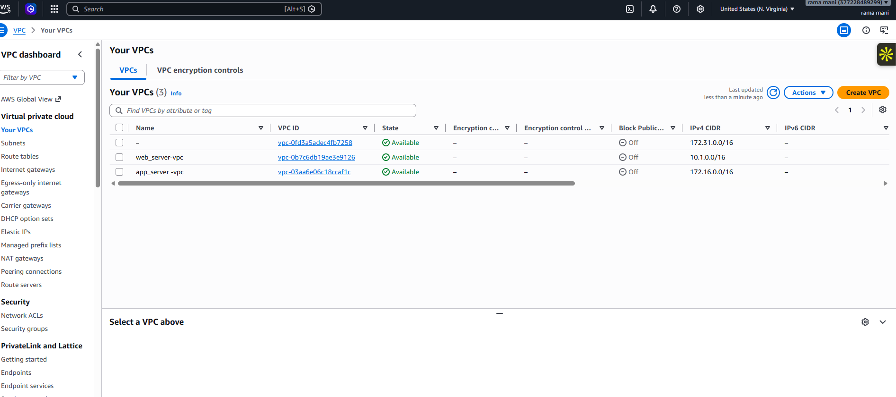

### 02 · Request same-Region peering

Select the Web VPC as requester and the App VPC as accepter. Both CIDRs are displayed before submission.

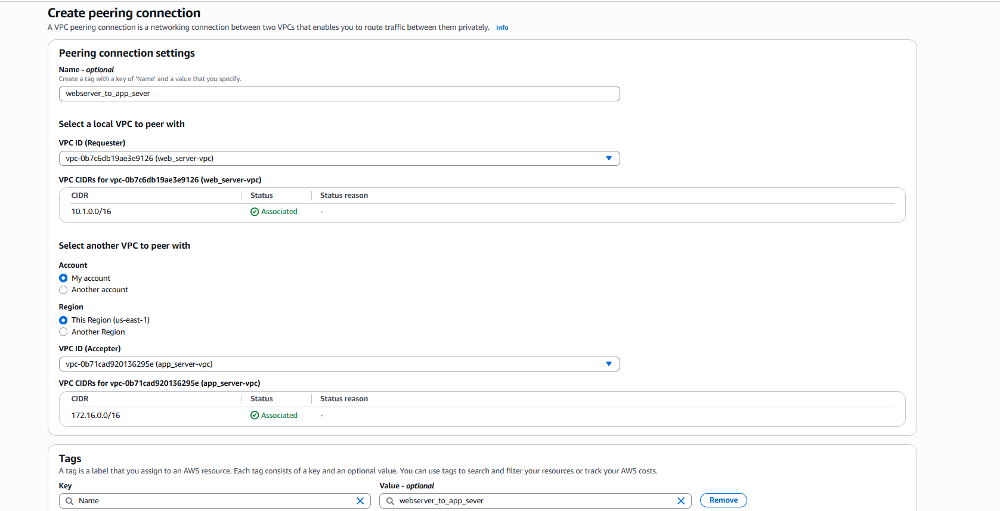

### 03 · Accept the request

The newly requested connection is pending acceptance. Use the acceptance action to progress the connection; a later screenshot shows this Web–App connection as Active.

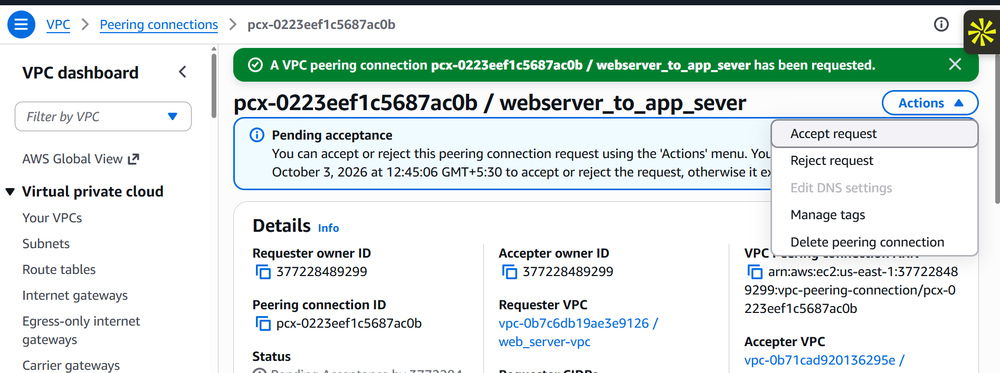

### 04 · Identify the subnet route tables

The inventory captures identify the named Web and App route tables and their explicit subnet associations. Route entries must be added to the tables actually used by the instances.

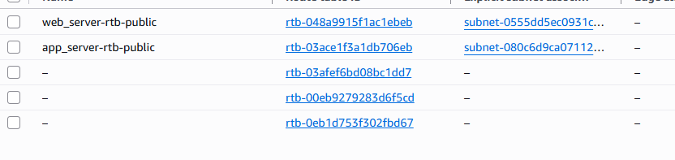

View additional route-table association captures

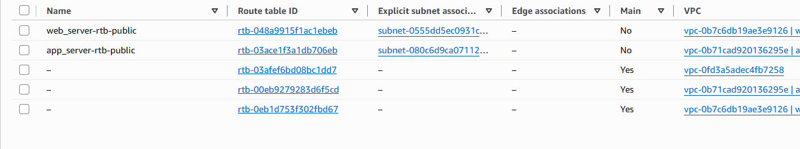

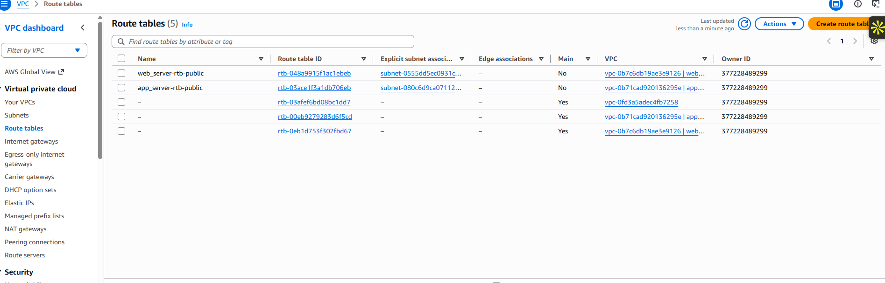

### 05 · Add the Web-to-App route

The Web route editor targets `172.16.0.0/16` through the peering connection. This screenshot captures the edit form before saving. Its existing default internet route serves a separate purpose; the more specific peer route selects the private path.

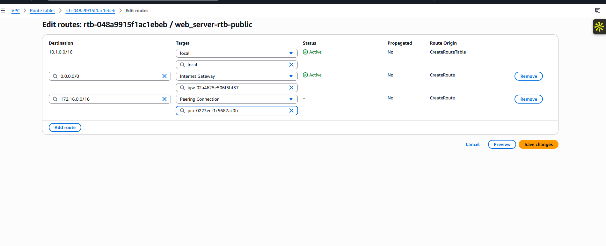

### 06 · Add the return route

The App route editor targets `10.1.0.0/16` through the same peering connection. Save the changes and inspect the final route state in the console.

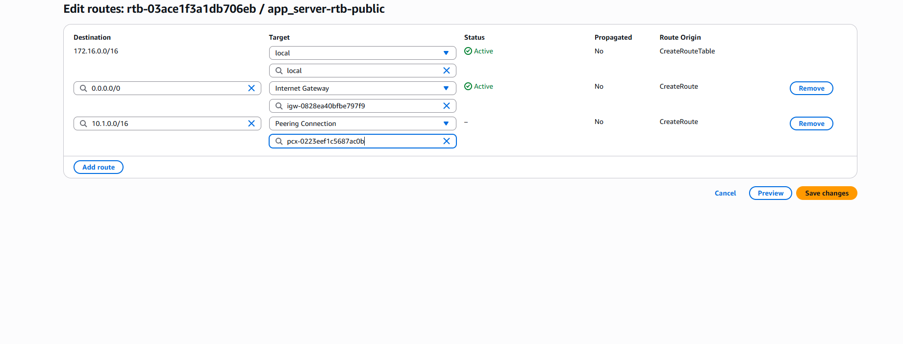

### 07 · Accept inter-Region peering

The acceptance dialog shows a requester in Ohio with CIDR `192.168.0.0/16` and the Web accepter in N. Virginia. The Web–App connection is already Active in the background. A separate background error references a VPC that does not exist; verify current VPC IDs and Regions when reproducing the setup. This dialog itself does not prove that acceptance has completed.

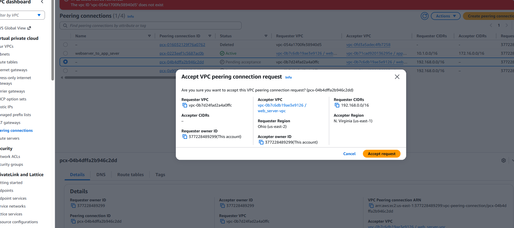

### 08 · Verify private connectivity

Three EC2 Instance Connect sessions show successful replies between the deployed private IPs. The source instance details at the bottom of each session identify Web, App, and DB.

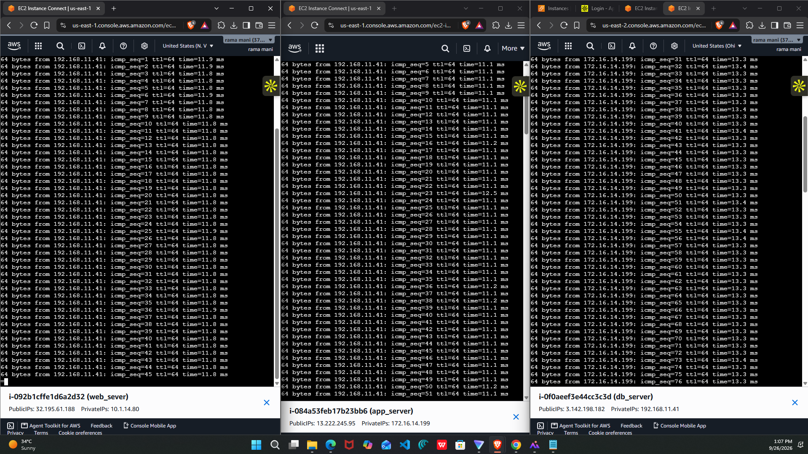

### Evidence still useful for a complete audit

- Final Active state of all three peer connections.
- Saved routes for the Database VPC and both cross-Region paths.
- Security-group rules and actual deployed subnet CIDRs.
- Web-to-App connectivity and application-port tests.

## Troubleshooting

| Symptom | What to inspect |
| --- | --- |
| Connection remains pending | Accept from the peer account and the accepter Region. |
| Route shows `blackhole` | Confirm the selected peering connection exists and is Active. |
| Every request times out | Check both subnet route tables, associations, security groups, ACLs, and host firewalls. |
| One pair works but another fails | Verify the failing pair's direct peering connection and its two routes. |
| Ping succeeds but service connection fails | Check the service port, listener, bind address, and TCP rules. |
| Service connects but ping fails | Check ICMP rules; a service can work while ICMP is blocked. |
| Private IP works but hostname fails | Inspect DNS settings and zone associations separately. |

## Cleanup

After collecting evidence, remove only the resources created for this lab:

1. Terminate the test instances and remove any lab database resources.
2. Remove the six peer routes and temporary security-group rules.
3. Delete the three peering connections.
4. Remove lab-only endpoints, NAT gateways, and other dependencies if you created them.
5. Delete the lab subnets, custom route tables, security groups, and VPCs.
6. Check for retained volumes, snapshots, and allocated public IPs.

Resource usage and inter-Region data transfer can incur charges. Review [Amazon VPC pricing](https://aws.amazon.com/vpc/pricing/) before running the lab.

## Key takeaways

The finished lab should demonstrate three direct peer connections, six explicit routes, and verified private traffic between each VPC pair. Routing establishes a path; security controls determine which traffic may use it. Save both the configuration and test evidence so the implementation can be reproduced and reviewed.
