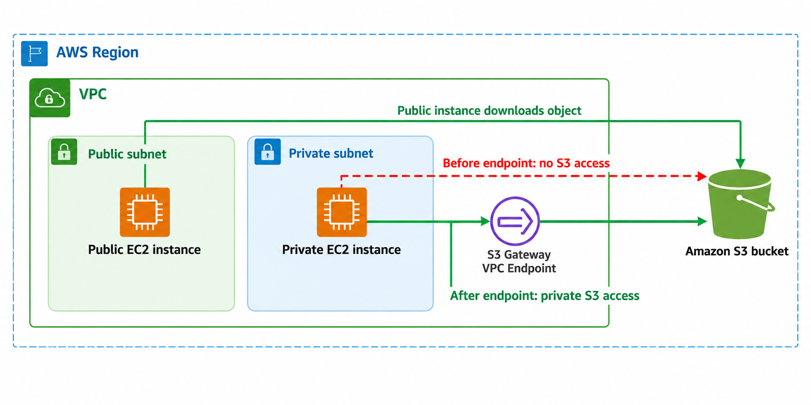
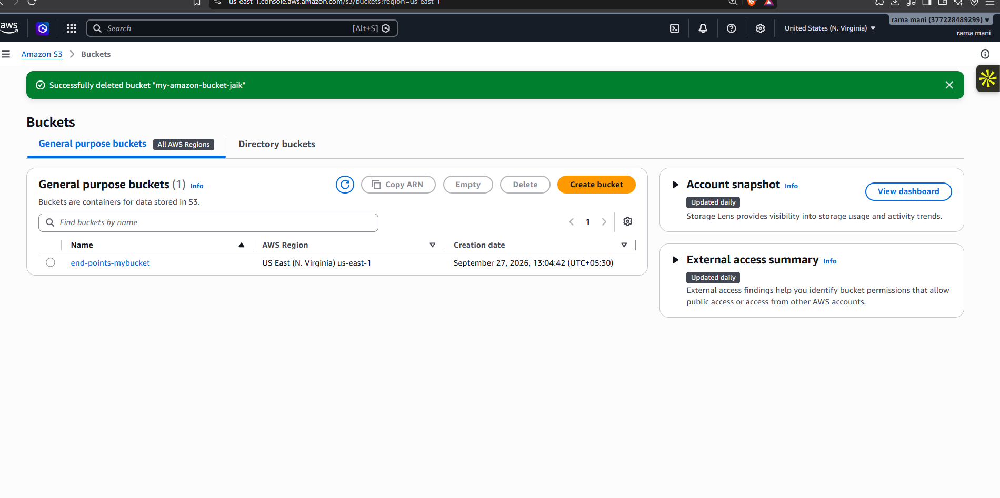
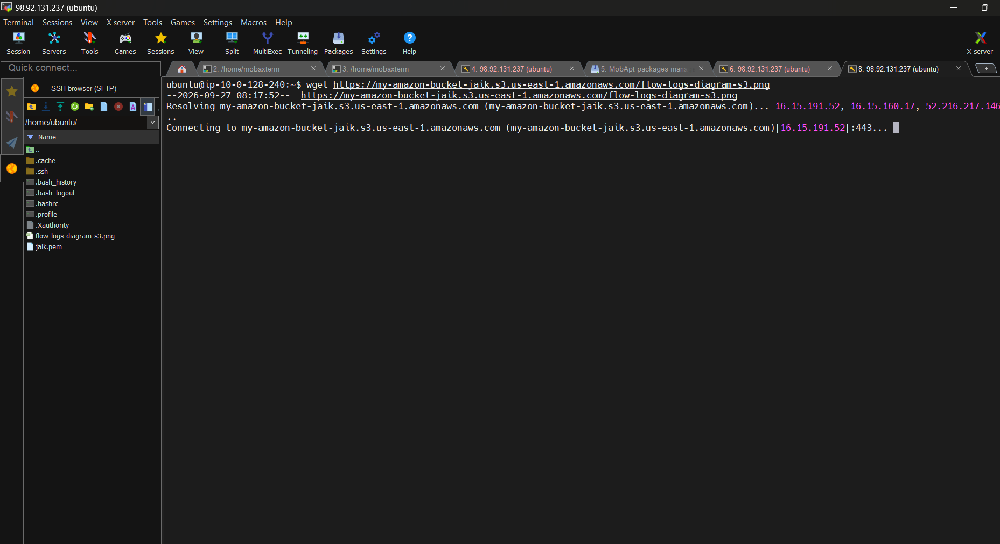
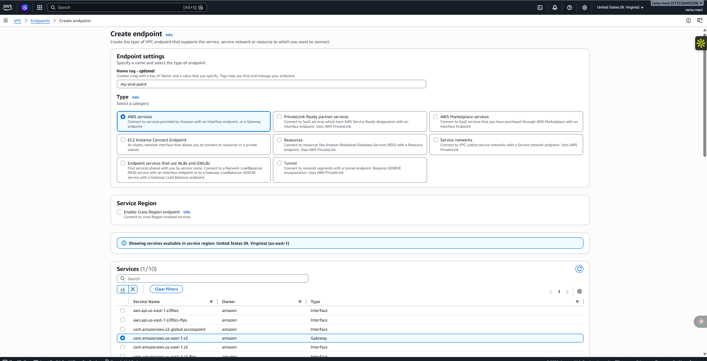
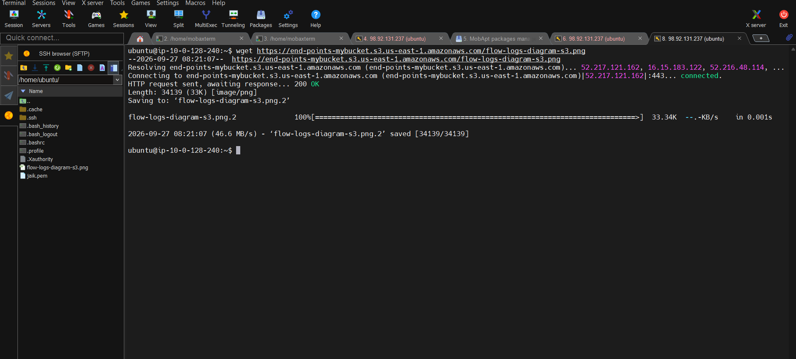

# Amazon S3 Gateway VPC Endpoint

> Proving that a private EC2 instance cannot reach an S3 object until an S3 Gateway VPC Endpoint is created.

**Project 03 · AWS Networking & Storage · Region: us-east-1**

## What I built

I created an S3 bucket and two EC2 instances: one public and one private. The public instance downloaded an S3 object successfully. The private instance could not download the object before the endpoint was created. After creating an Amazon S3 Gateway VPC Endpoint, the same private instance downloaded the object successfully.

## Architecture



This diagram focuses on the test flow. A Gateway VPC Endpoint is associated with the route table for the private subnet by AWS, but configuring a separate route table was not a step in this practice.

## Services used

| Service | Purpose |
| --- | --- |
| Amazon S3 | Stores the test object |
| Amazon EC2 | Provides a public and private test instance |
| Amazon VPC | Provides the network and subnets |
| S3 Gateway VPC Endpoint | Enables private S3 access for the private instance |

## Implementation and results

### Step 1 — Create the S3 bucket

Created the `end-points-mybucket` bucket in `us-east-1` and uploaded a test object.



### Step 2 — Create two EC2 instances

Created a `public-instance` with a public IPv4 address and a `private-instance` without a public IPv4 address.


### Step 3 — Download from the public instance

The public instance downloaded the S3 object successfully over its public network path.

```bash
wget https://end-points-mybucket.s3.us-east-1.amazonaws.com/flow-logs-diagram-s3.png
```


### Step 4 — Attempt download from the private instance

Before the S3 Gateway Endpoint existed, the private instance could not complete the download. The terminal remains at the connection attempt because the private subnet did not have an available path to the S3 object.



### Step 5 — Create the S3 Gateway VPC Endpoint

In **VPC → Endpoints → Create endpoint**, selected **AWS services**, searched for `s3`, and selected the Gateway service `com.amazonaws.us-east-1.s3`.



### Step 6 — Download from the private instance after creating the endpoint

After the endpoint was created, the private instance downloaded the same S3 object successfully. The response returned **HTTP 200 OK** and the file was saved.



## Key takeaway

An S3 Gateway VPC Endpoint gives workloads in a private subnet a private route to Amazon S3. This is useful when a private instance needs S3 access without receiving a public IPv4 address or relying on a NAT gateway for this S3 traffic.

## Why use an S3 Gateway VPC Endpoint?

- Keeps S3 access on AWS networking for VPC workloads.
- Allows private instances to reach S3 without public internet access for this path.
- Supports endpoint policies and S3 bucket policies for tighter access control.
- Is designed specifically for Amazon S3 and DynamoDB.

## Cleanup

1. Terminate both EC2 instances.
2. Delete the Gateway VPC Endpoint.
3. Empty and delete the S3 bucket if it is no longer needed.

## References

- [AWS: Gateway endpoints for Amazon S3](https://docs.aws.amazon.com/vpc/latest/privatelink/vpc-endpoints-s3.html)
- [AWS: VPC endpoint concepts](https://docs.aws.amazon.com/vpc/latest/privatelink/concepts.html)

