# AWS Transit Gateway Multi-Region Peering

> Connecting three VPCs across North Virginia and Ohio with Transit Gateway attachments, inter-Region peering, and private routing.

**Project 04 · AWS Networking · Regions: us-east-1 and us-east-2**

way |

The Transit Gateways were peered between Regions. The peering request was initiated from Ohio and accepted in North Virginia. Static Transit Gateway routes and VPC route-table routes complete the private path between every server.

## Architecture

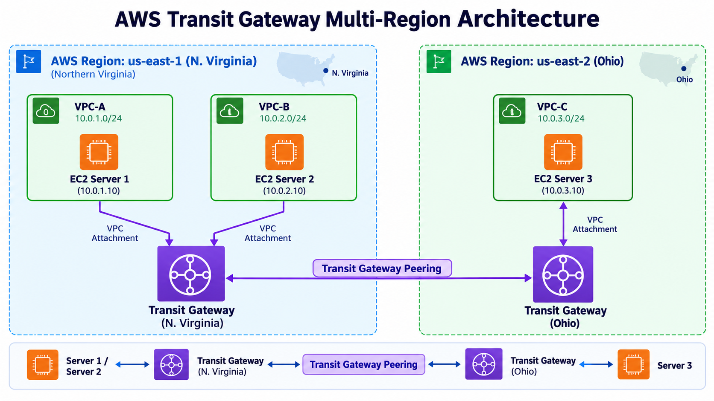

Traffic from a server first follows a VPC route to its local Transit Gateway. For the remote Region, the local Transit Gateway sends traffic through the peering attachment to the remote Transit Gateway, which forwards it to the destination VPC attachment.

The diagram shows the network topology and CIDR ranges; the table above records the private IPs used in the verified ping tests.

## Services used

| Service | Purpose |
| --- | --- |
| Amazon VPC | Supplies the three isolated networks and their route tables |
| Amazon EC2 | Supplies one test server in each VPC |
| AWS Transit Gateway | Provides a scalable hub for VPC connectivity in each Region |
| Transit Gateway peering | Carries private traffic between the Regional Transit Gateways |
| Security groups | Permit ICMP for the connectivity tests |

## Implementation

### 1. Create the VPCs and servers

Created VPC-A and VPC-B in North Virginia, plus VPC-C in Ohio. One EC2 server was launched in each VPC using the private IP addresses listed above.

### 2. Create and attach the Transit Gateways

- Created one Transit Gateway in `us-east-1`, then attached VPC-A and VPC-B.
- Created a second Transit Gateway in `us-east-2`, then attached VPC-C.

### 3. Create and accept the peering attachment

The peering attachment was requested from the Ohio Transit Gateway and accepted in North Virginia.

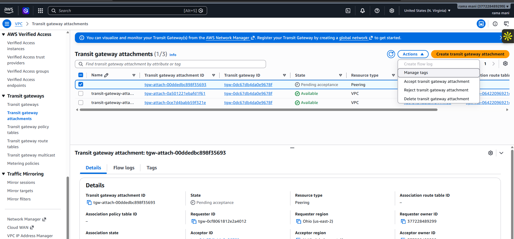

### 4. Add Transit Gateway static routes

The Transit Gateway route tables were configured to direct remote CIDRs through the peering attachment:

| Transit Gateway | Destination | Next hop |
| --- | --- | --- |
| North Virginia | `10.0.3.0/24` | Peering attachment to Ohio |
| Ohio | `10.0.1.0/24` | Peering attachment to North Virginia |
| Ohio | `10.0.2.0/24` | Peering attachment to North Virginia |

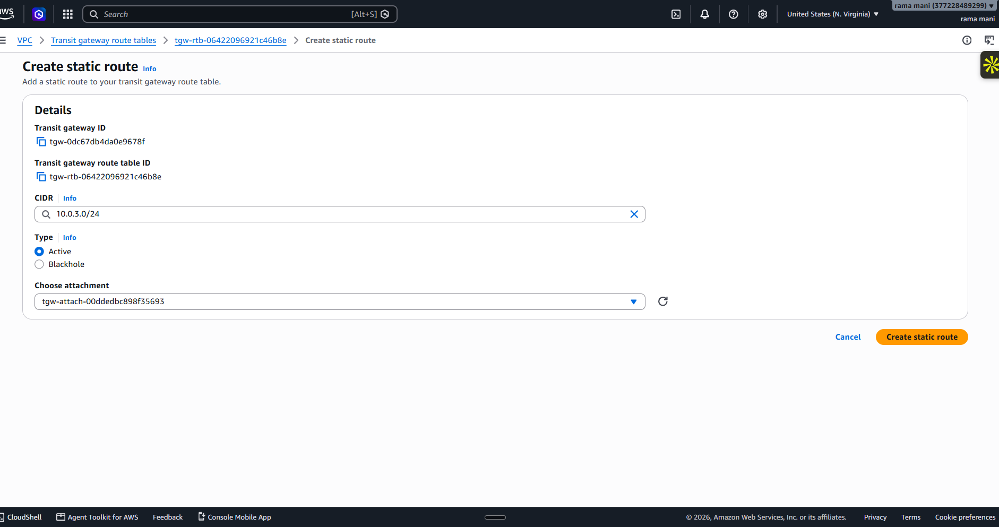

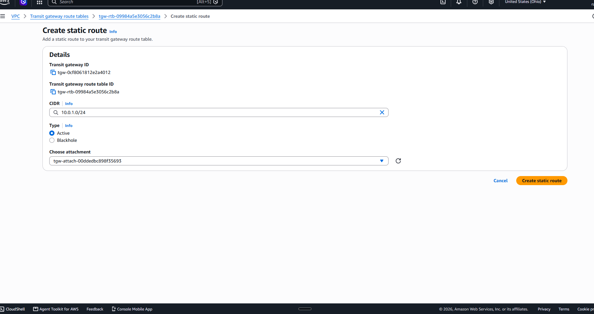

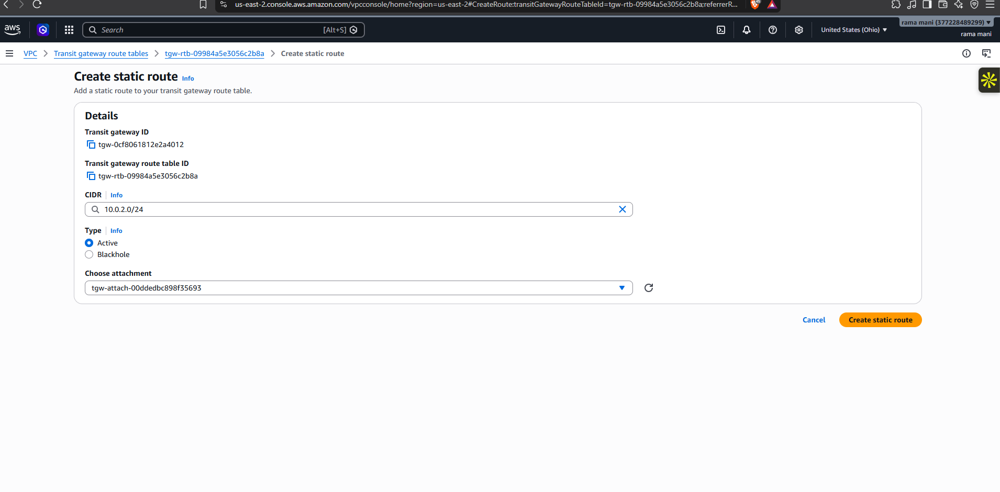

### 5. Update VPC route tables

Each VPC route table sends traffic for the other two VPC CIDRs to the Transit Gateway in its Region.

| VPC | Transit Gateway routes |
| --- | --- |
| VPC-A | `10.0.2.0/24`, `10.0.3.0/24` |
| VPC-B | `10.0.1.0/24`, `10.0.3.0/24` |
| VPC-C | `10.0.1.0/24`, `10.0.2.0/24` |

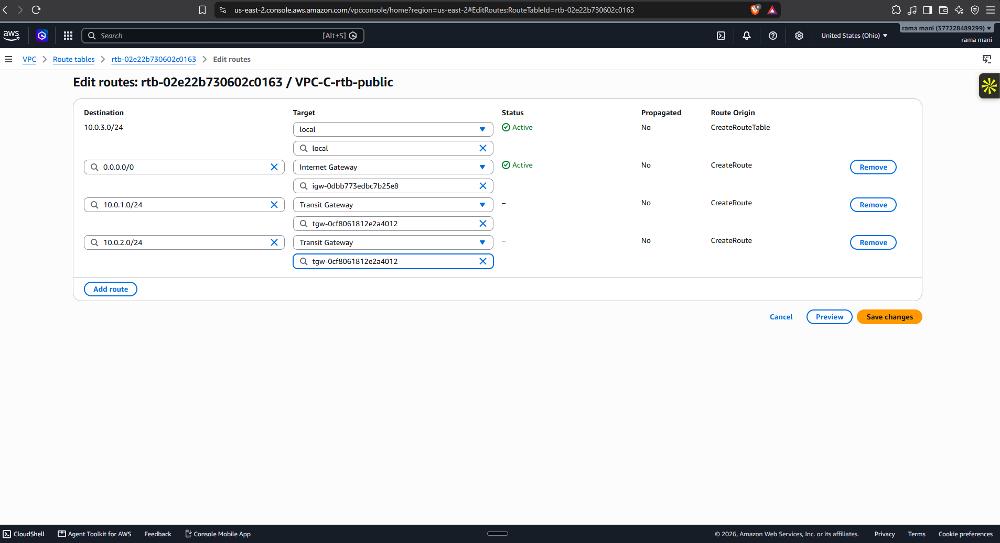

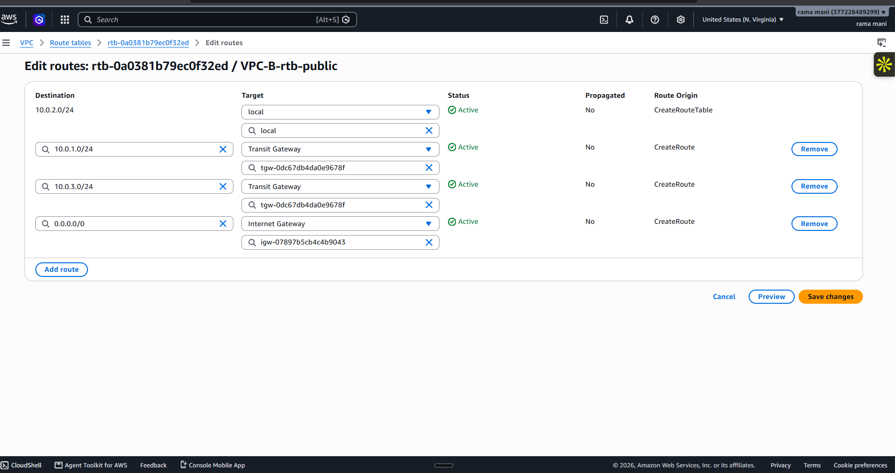

## Connectivity validation

ICMP was allowed between the servers. Ping tests confirmed private connectivity between all three VPCs:

| Source server | Tested destinations | Result |
| --- | --- | --- |
| Server-1 (`10.0.1.7`) | Server-2, Server-3 | Successful replies from `10.0.2.13` and `10.0.3.6` |
| Server-2 (`10.0.2.13`) | Server-1, Server-3 | Successful replies from `10.0.1.7` and `10.0.3.6` |
| Server-3 (`10.0.3.6`) | Server-1, Server-2 | Successful replies from `10.0.1.7` and `10.0.2.13` |

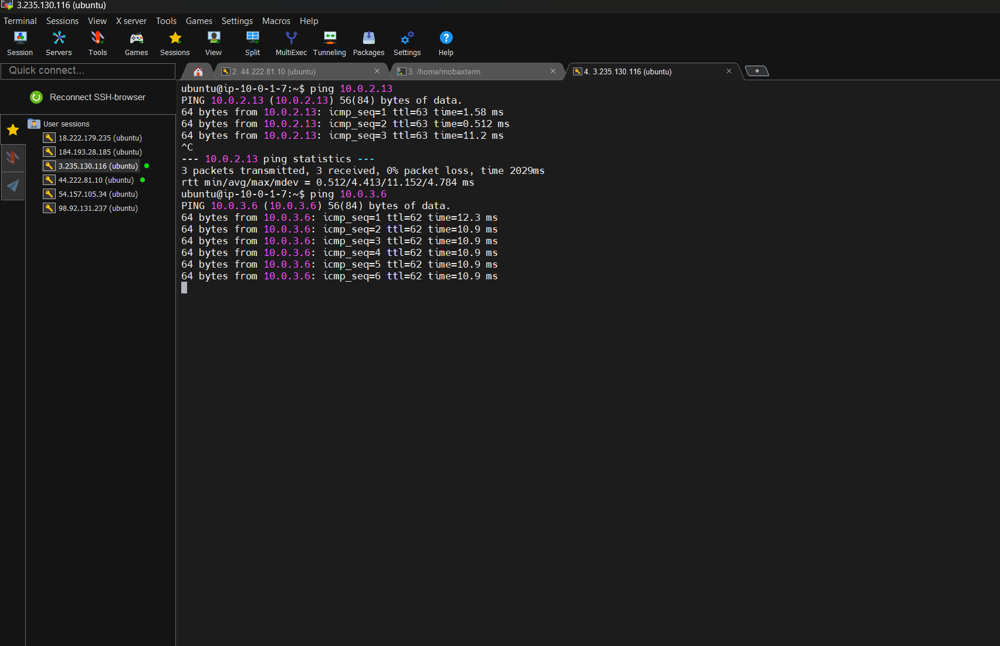

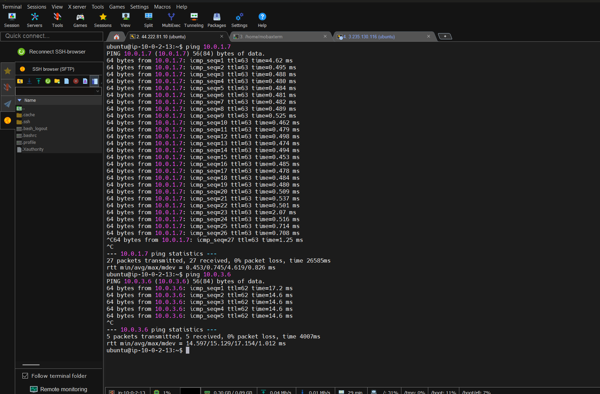

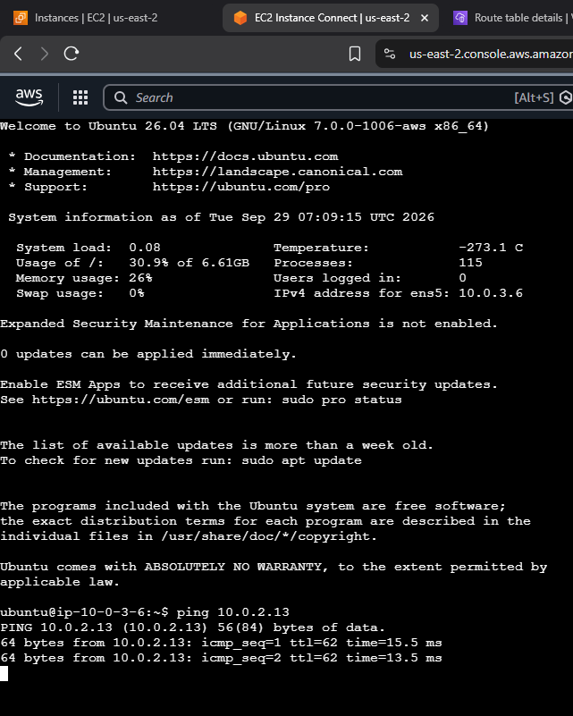

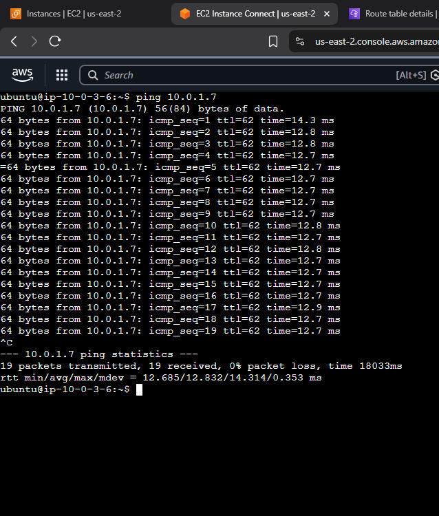

## Key takeaways

- Transit Gateway simplifies connectivity compared with managing a full mesh of VPC peering connections.
- Inter-Region Transit Gateway peering needs routing on both Transit Gateways and in the participating VPC route tables.
- Connectivity validation is only successful when routes, attachments, and security-group rules all align.
- The traffic remains private: the ping tests use the servers’ VPC private IP addresses.

## Cleanup

1. Terminate the three EC2 instances.
2. Remove the VPC route-table entries that target the Transit Gateways.
3. Remove Transit Gateway static routes and the peering attachment.
4. Delete VPC attachments, then the Transit Gateways.
5. Delete the VPC resources if they are no longer needed.

## References

- [AWS: Transit Gateway peering attachments](https://docs.aws.amazon.com/vpc/latest/tgw/tgw-peering.html)
- [AWS: Transit Gateway route tables](https://docs.aws.amazon.com/vpc/latest/tgw/tgw-route-tables.html)
