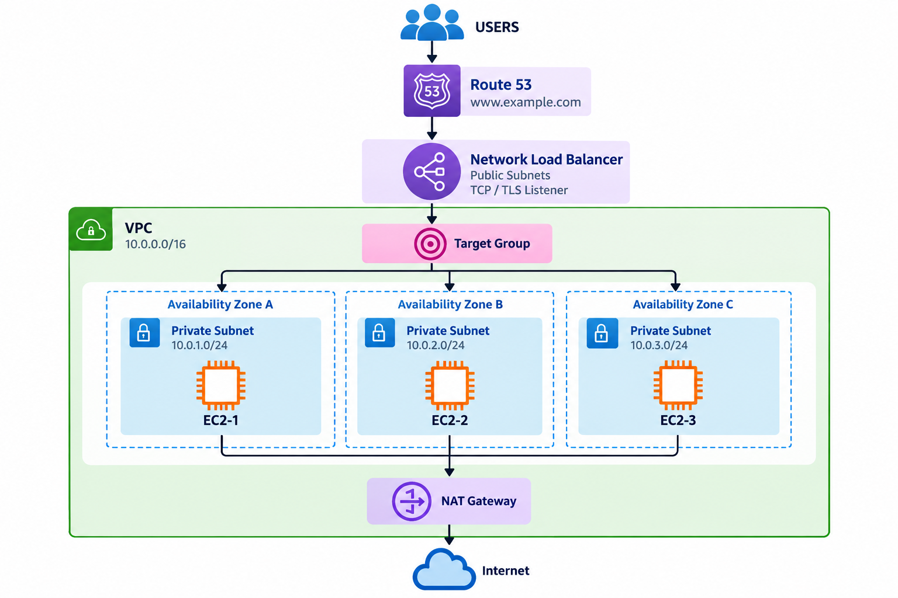
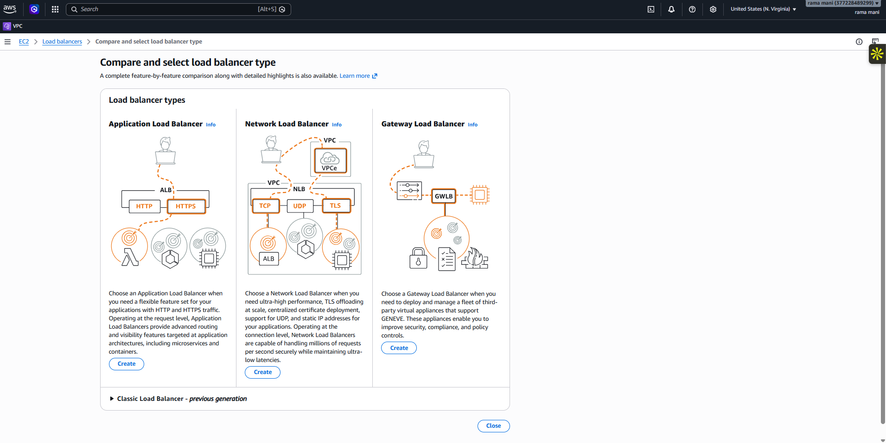
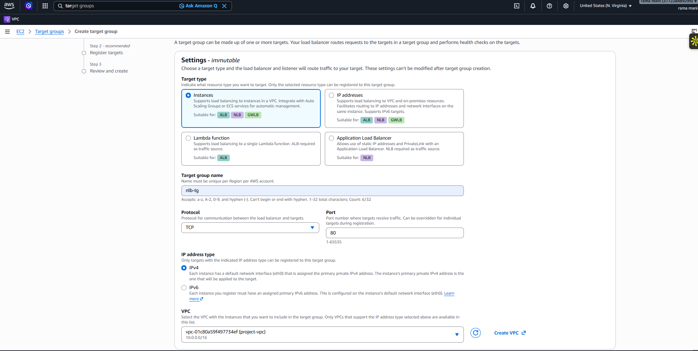
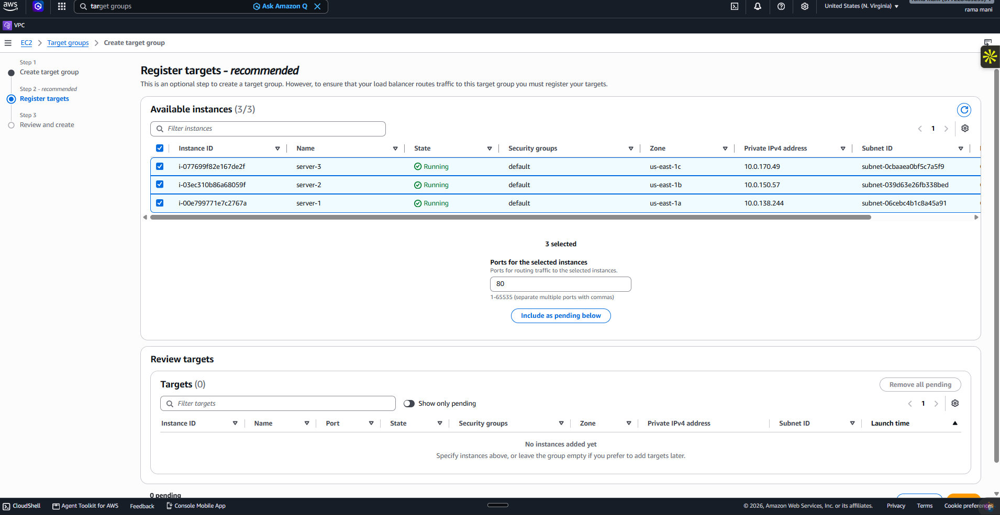
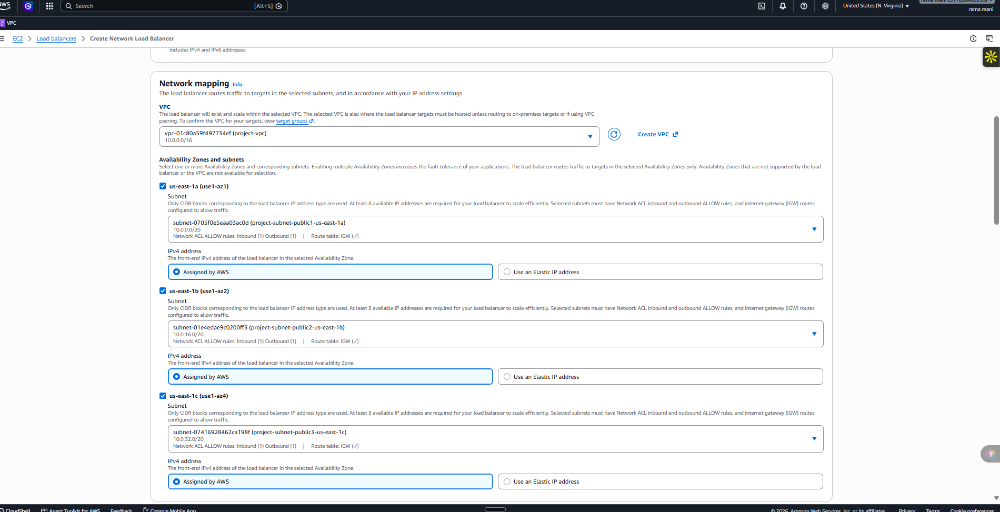

# AWS Network Load Balancer

> Exploring Layer 4 load balancing with a Network Load Balancer (NLB), a TCP target group, and EC2 targets across three Availability Zones.

**Project 06 · AWS Networking & Compute · Region: us-east-1**

## What this project covers

A Network Load Balancer operates at **Layer 4 (the transport layer)**. It forwards connections using network information and supports **TCP**, **UDP**, and **TLS** listeners.

This project follows the configuration path for an internet-facing NLB:

1. Use three EC2 servers as back-end targets.
2. Create an instance target group named `nb-tg` with TCP port `80`.
3. Select the three servers for target registration.
4. Configure an NLB in the project VPC across three Availability Zones.

The screenshots show the target selection and NLB network-mapping stages. They do not show the final creation confirmation, listener configuration, or a completed health-check result, so those outcomes are intentionally not claimed here.

## Architecture

The intended request path is:

`Users → Route 53 → Network Load Balancer → Target Group → EC2 targets`

The NLB is placed across multiple public subnets for availability. Target instances can be in private subnets when their networking and security rules allow the NLB to reach their application port.

## NLB vs. ALB

| Capability | Network Load Balancer | Application Load Balancer |
| --- | --- | --- |
| OSI layer | Layer 4 | Layer 7 |
| Traffic | TCP, UDP, TLS | HTTP, HTTPS |
| Routing decisions | Connection and network level | Host, path, headers, and application level |
| Typical use | High-performance TCP/UDP or static-IP workloads | Web applications and path-based routing |

An NLB is not automatically "better" than an ALB. The correct choice depends on the traffic and routing requirements.

## Implementation evidence

### Step 1 — Select the load balancer type

Selected **Network Load Balancer** from the EC2 Load Balancers page. AWS presents NLB as the choice for high-performance workloads and network-layer traffic.

### Step 2 — Create the target group

Created an instance target group named `nb-tg` in the project VPC. The selected protocol is **TCP** and the target port is **80**.

### Step 3 — Select EC2 targets

Selected three running instances—`server-1`, `server-2`, and `server-3`—on the target-registration screen. The screenshot was captured before the selected targets were included as pending, so it records the selection step rather than final registration.

### Step 4 — Configure Network Load Balancer subnets

Configured the project VPC (`10.0.0.0/16`) and selected one public subnet in each of three Availability Zones: `us-east-1a`, `us-east-1b`, and `us-east-1c`. AWS-assigned IPv4 addressing is selected for each mapping.

## Next validation steps

After creating the NLB, validate the configuration by:

1. Adding a listener that forwards to `nb-tg`.
2. Confirming all registered targets become healthy.
3. Allowing the listener port in security groups and network ACLs as needed.
4. Sending TCP traffic to the NLB DNS name and confirming distribution to healthy targets.

## Key takeaways

- **NLB = Layer 4**: suited to TCP, UDP, and TLS traffic.
- **ALB = Layer 7**: suited to HTTP/HTTPS-aware routing such as host- and path-based rules.
- A target group defines where the listener forwards connections and how it performs health checks.
- Multi-AZ subnet mapping improves availability for the load-balancer entry point.

## Cleanup

1. Delete the Network Load Balancer and its listeners.
2. Delete the target group after it is no longer referenced.
3. Terminate the EC2 targets if they were created only for this exercise.

## References

- [AWS: Network Load Balancers](https://docs.aws.amazon.com/elasticloadbalancing/latest/network/introduction.html)
- [AWS: Target groups for Network Load Balancers](https://docs.aws.amazon.com/elasticloadbalancing/latest/network/load-balancer-target-groups.html)
