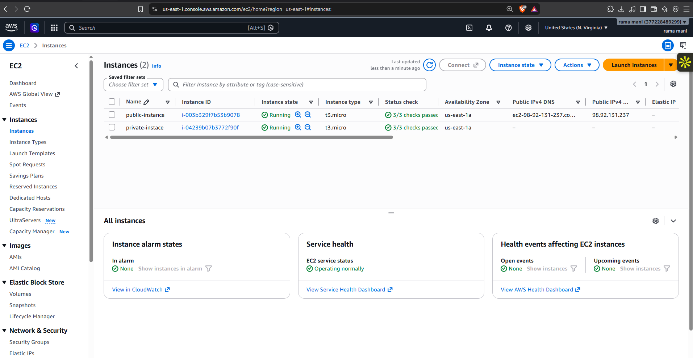
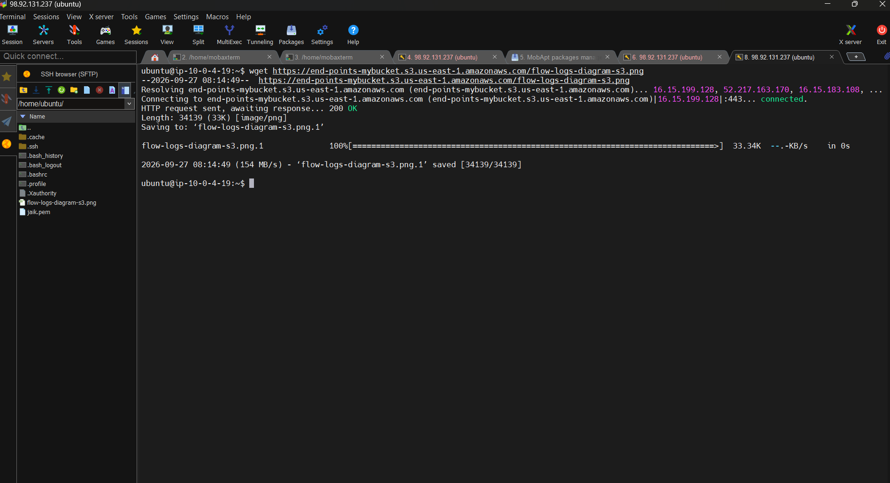

# S3 Gateway VPC Endpoint

> Private Amazon S3 access from a VPC without sending the S3 traffic through a NAT gateway or Internet gateway.

**Project 03 · AWS Networking & Storage · Region: us-east-1**

## Goal

This project demonstrates how an Amazon S3 **Gateway VPC Endpoint** lets an EC2 instance in a private subnet access an S3 bucket privately. The endpoint is associated with a route table, so traffic for Amazon S3 uses the endpoint route instead of requiring public internet access.

## Architecture


The private EC2 instance sends S3-bound traffic to its route table. The S3 Gateway VPC Endpoint adds an AWS-managed route for the S3 prefix list, which keeps that path within AWS networking. Gateway endpoints do not create elastic network interfaces in a subnet.

## Services used

| Service | Purpose |
| --- | --- |
| Amazon VPC | Network boundary, subnets, and route tables |
| Amazon EC2 | Public and private test instances |
| Amazon S3 | Private object download target |
| Gateway VPC Endpoint | Private VPC route to Amazon S3 |

## Implementation

1. Launch a public test instance and a private test instance in the VPC.
2. Create an S3 bucket and upload a test object.
3. In **VPC → Endpoints → Create endpoint**, choose **AWS services**.
4. Search for `s3` and select the Gateway service: `com.amazonaws.us-east-1.s3`.
5. Select the VPC and associate the route table used by the private subnet. AWS adds a route that targets the S3 managed prefix list.
6. Configure the endpoint policy. The default policy permits full S3 access; a production policy should limit access to the required bucket and actions.
7. From the private instance, retrieve an S3 object and verify a successful response.

### Test command

```bash
wget https://end-points-mybucket.s3.us-east-1.amazonaws.com/flow-logs-diagram-s3.png
```

The supplied test output returned **HTTP 200 OK** and saved the object, confirming S3 object access from an internal `10.x` host. In a production validation, also inspect the private subnet's route table and endpoint policy before relying on the path.

## Gateway endpoint vs. interface endpoint

| Capability | Gateway endpoint | Interface endpoint |
| --- | --- | --- |
| Supported AWS services | Amazon S3 and DynamoDB | Many AWS, partner, and customer services |
| Routing model | Route-table entry to an AWS prefix list | PrivateLink network interfaces in subnets |
| Security controls | Endpoint policy, bucket policy, route tables | Security groups, endpoint policy, private DNS |
| Typical use | Private S3 or DynamoDB access from a VPC | Private access to services such as Secrets Manager, ECR, or APIs |

For this use case, the S3 Gateway endpoint is the appropriate choice because the target service is Amazon S3 and the private subnet can use a route-table association.

## Security recommendations

- Limit the endpoint policy to the required bucket, prefixes, and S3 actions.
- Restrict the bucket policy with `aws:SourceVpce` or `aws:SourceVpc` when access should only come through this VPC path.
- Keep private workloads in private subnets and allow only the outbound traffic they need.
- Use least-privilege IAM roles on EC2 rather than long-lived access keys.

## Evidence

### 1. Public and private EC2 test instances



### 2. Selecting the Amazon S3 Gateway endpoint service


### 3. Downloading an S3 object from an internal host



### 4. Final S3 bucket state


## Troubleshooting

| Symptom | Check |
| --- | --- |
| S3 request times out or cannot resolve | Confirm DNS settings, the endpoint state, and the route-table association. |
| Access denied | Check the EC2 IAM role, S3 bucket policy, and VPC endpoint policy together. |
| Traffic uses NAT instead | Confirm that the private subnet uses the route table associated with the gateway endpoint. |
| Endpoint cannot reach the bucket | Verify the selected endpoint service matches the bucket's Region. |

## Cleanup

1. Terminate the test EC2 instances.
2. Delete the Gateway VPC Endpoint. AWS removes its managed route from associated route tables.
3. Empty and delete the S3 bucket if it is no longer needed.

## References

- [AWS: Gateway endpoints for Amazon S3](https://docs.aws.amazon.com/vpc/latest/privatelink/vpc-endpoints-s3.html)
- [AWS: VPC endpoint concepts](https://docs.aws.amazon.com/vpc/latest/privatelink/concepts.html)

