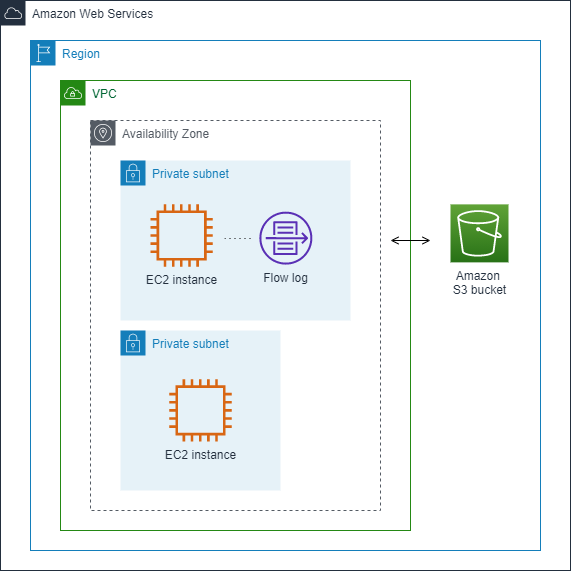
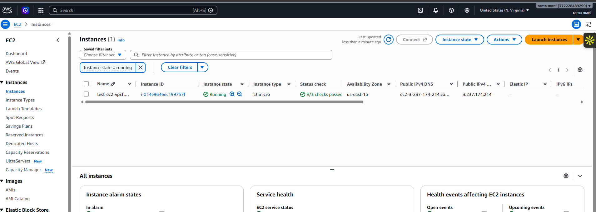
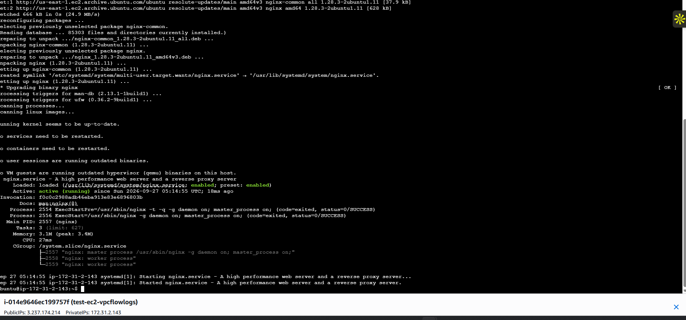
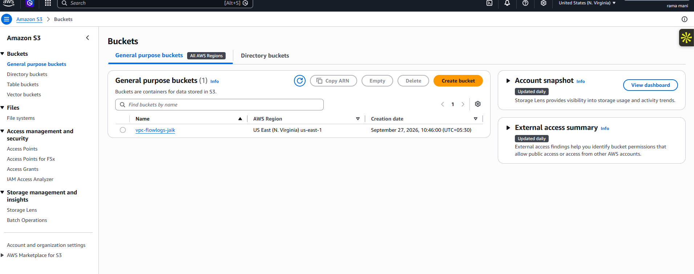
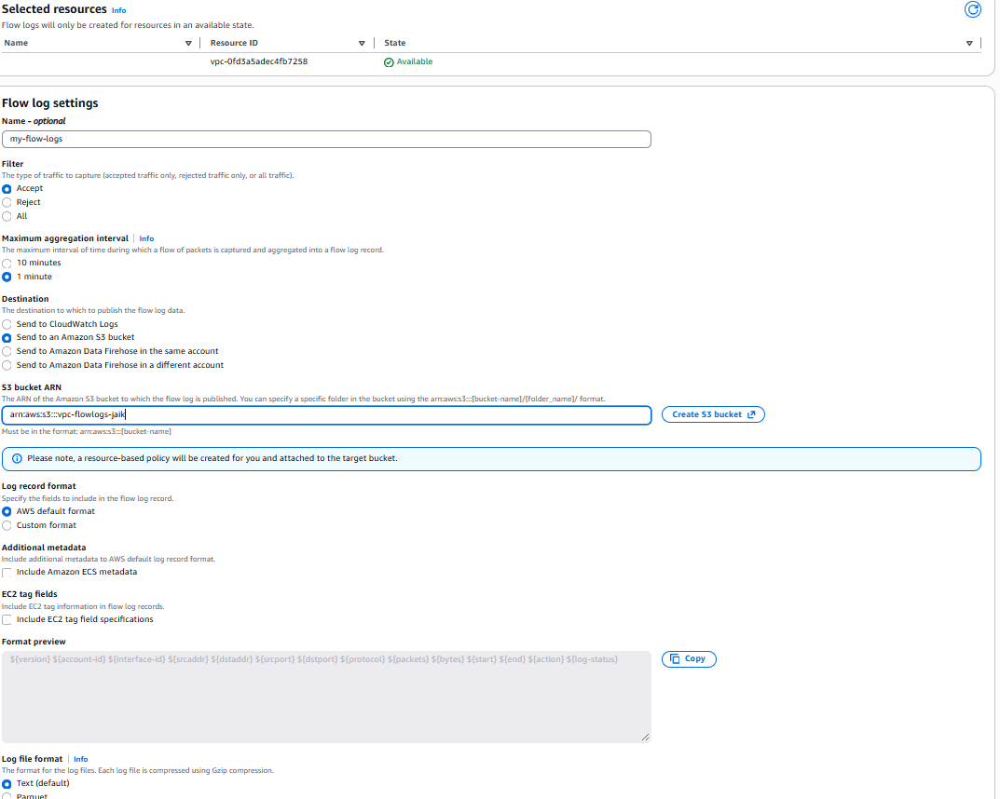
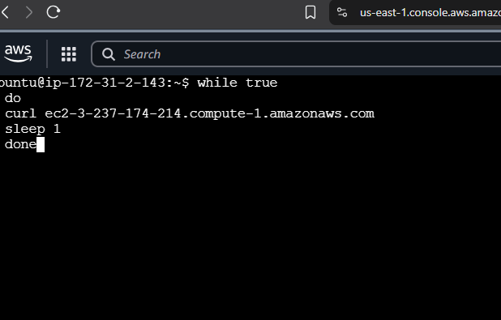
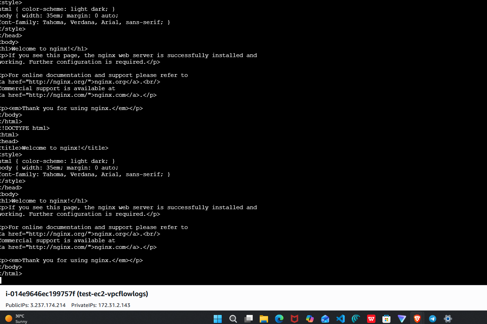
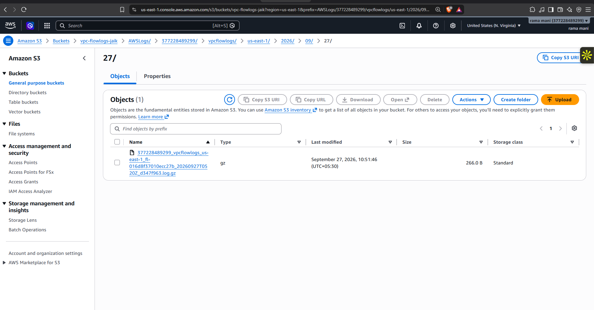
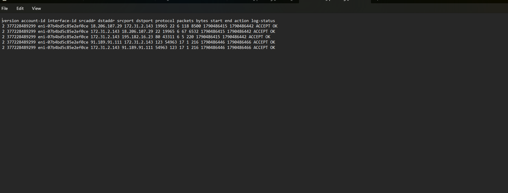

<div align="center">

# VPC Flow Logs to Amazon S3
### Generate traffic · Capture network metadata · Inspect the evidence

**Project 02 — AWS Networking & Observability**

[Architecture](#architecture) · [Implementation](#implementation) · [Evidence](#evidence) · [Cleanup](#cleanup)

</div>

---

## Objective

Configure **VPC Flow Logs** for the default VPC in `us-east-1`, publish accepted traffic records to an Amazon S3 bucket, generate web traffic from an EC2 instance running Nginx, and inspect the resulting log records.

This project captures metadata about network flows. It does not capture the full HTTP request or the Nginx response body.

## Architecture



```text
Internet client
      │ HTTPS / HTTP response traffic
      ▼
EC2 instance: test-ec2-vpcflowlogs
Private IP: 172.31.2.143
      │
      ▼
Default VPC: 172.31.0.0/16  (us-east-1)
      │  VPC Flow Logs — ACCEPT, 1-minute aggregation
      ▼
S3 bucket: vpc-flowlogs-jaik
      │
      ▼
Compressed flow-log object (.log.gz)
```

## Resources shown in the evidence

| Resource | Observed value |
| --- | --- |
| AWS Region | `us-east-1` — US East (N. Virginia) |
| VPC | Default VPC, CIDR `172.31.0.0/16` |
| EC2 instance | `test-ec2-vpcflowlogs` (`t3.micro`) |
| Instance private IP | `172.31.2.143` |
| Nginx | Active and running in the captured session |
| S3 bucket | `vpc-flowlogs-jaik` |
| Log filter | `ACCEPT` |
| Aggregation interval | 1 minute |
| Destination | Amazon S3, AWS default format |

## Implementation

### 1. Launch a test instance

Launch an Ubuntu EC2 instance in a subnet of the target VPC. The supplied evidence shows one running `t3.micro` instance with all three status checks passing.



### 2. Install and confirm Nginx

Connect to the instance and run:

```bash
sudo apt update
sudo apt install nginx -y
sudo systemctl restart nginx
sudo systemctl status nginx
```

The captured output confirms that Nginx was installed, enabled, and **active (running)**.



### 3. Create the S3 destination

Create an S3 bucket in the same Region or select an existing one. The project uses `vpc-flowlogs-jaik` in `us-east-1`.



### 4. Create the VPC flow log

In the VPC console, select the VPC and choose **Flow logs → Create flow log**. Configure:

| Setting | Value used |
| --- | --- |
| Name | `my-flow-logs` |
| Filter | `Accept` |
| Aggregation interval | `1 minute` |
| Destination | `Send to an Amazon S3 bucket` |
| S3 ARN | `arn:aws:s3:::vpc-flowlogs-jaik` |
| Record format | AWS default format |

AWS adds the bucket policy required for this delivery flow. Use a narrowly scoped bucket policy, keep Block Public Access enabled, and avoid placing general application data in the logging bucket.



AWS flow logs can send records for all network interfaces in a selected VPC to the S3 bucket. See [Publish flow logs to Amazon S3](https://docs.aws.amazon.com/vpc/latest/userguide/flow-logs-s3.html).

### 5. Generate traffic

From the instance, make repeated requests to its public DNS name:

```bash
while true
do
  curl ec2-3-237-174-214.compute-1.amazonaws.com
  sleep 1
done
```

The target shown here is the instance's public DNS name from the screenshot. For a real test, use the current public DNS name or an approved external test client. Stop the loop with `Ctrl+C` after collecting enough traffic.



The response includes the default Nginx welcome page, confirming that the web server served the request during the captured test.



### 6. Locate and inspect the log object

After the delivery interval, browse the S3 prefix created by VPC Flow Logs. The evidence shows a gzip object under the standard `AWSLogs/<account-id>/vpcflowlogs/<region>/<date>/` layout.



Download and decompress the object locally before inspection:

```bash
gunzip <flow-log-file>.log.gz
less <flow-log-file>.log
```

## Evidence

The captured default-format records use the field order:

```text
version account-id interface-id srcaddr dstaddr srcport dstport protocol packets bytes start end action log-status
```

The screenshots show `ACCEPT OK` records for the instance network interface `eni-07b4bd5c85e2ef0ce`, including public addresses and traffic involving private IP `172.31.2.143`. `ACCEPT` means the traffic was allowed; `OK` means the record was successfully captured. Use source/destination addresses, ports, protocol, packets, and bytes to investigate traffic patterns.



AWS provides examples for interpreting accepted, rejected, no-data, and skipped records in the [VPC Flow Log record examples](https://docs.aws.amazon.com/vpc/latest/userguide/flow-logs-records-examples.html).

### What the evidence proves

- The EC2 instance was running and Nginx was active.
- An S3 bucket existed for log delivery.
- A VPC-level flow log was configured for accepted traffic at a 1-minute aggregation interval.
- A compressed log object was delivered to S3.
- The downloaded records include successfully captured accepted flows.

### What this evidence does not prove

- Rejected traffic: the configured filter is `Accept`, so rejected packets are intentionally excluded.
- Full application requests or response bodies: flow logs contain network metadata, not packet payloads.
- A complete audit trail: logs can show `NODATA` or `SKIPDATA` in other circumstances and delivery is not a real-time monitoring guarantee.

## Troubleshooting

| Symptom | Check |
| --- | --- |
| No objects appear in S3 | Verify the bucket ARN, Region, bucket policy, and allow time for delivery. |
| No expected traffic in records | Confirm the log scope (VPC, subnet, or network interface), filter type, source/destination, and aggregation interval. |
| Need denied connections | Create or modify the flow log to collect `REJECT` or `ALL`, then generate a safe test. |
| Nginx does not respond | Check the service state, instance security group, network ACL, public routing, and the exact URL used. |
| Cannot read the object | Download it and decompress the `.gz` file before reviewing its text records. |

## Cleanup

1. Stop or terminate the test EC2 instance if it is no longer needed.
2. Delete the VPC Flow Log to stop further log delivery.
3. Remove the delivered S3 objects and the bucket only after retaining any evidence you need.
4. Review associated EBS volumes, Elastic IPs, and S3 storage for ongoing charges.

VPC Flow Logs delivered to S3 can incur vended-log ingestion and storage charges. Review [AWS pricing](https://aws.amazon.com/cloudwatch/pricing/) before extended use.